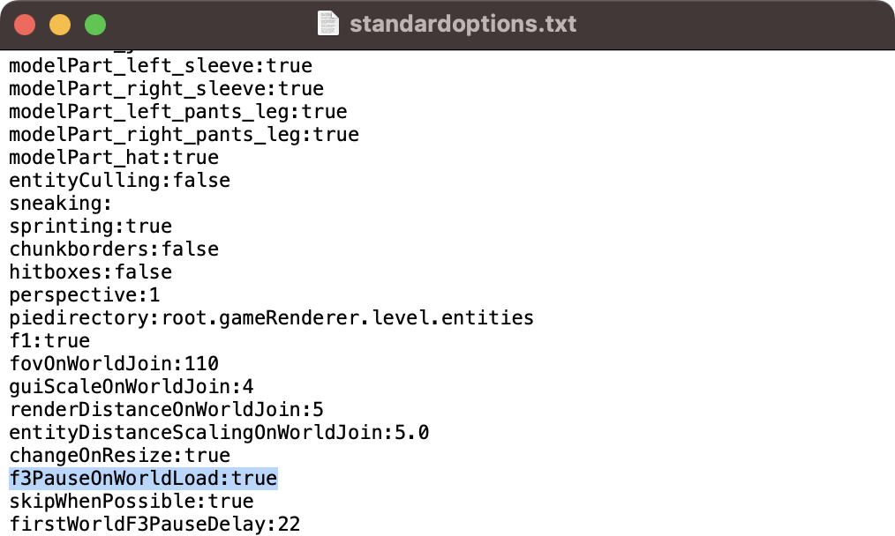
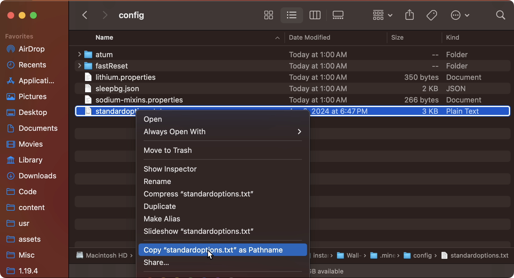
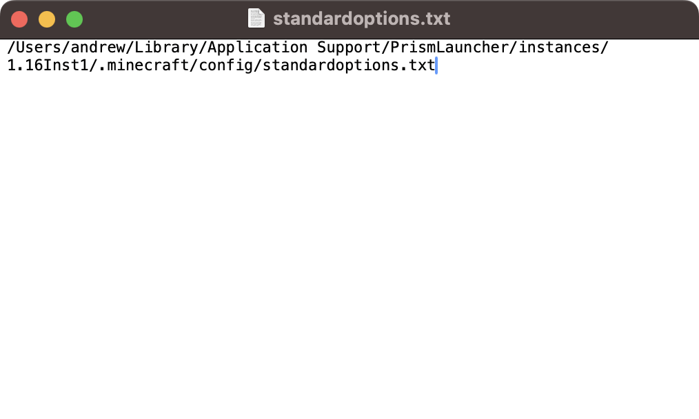
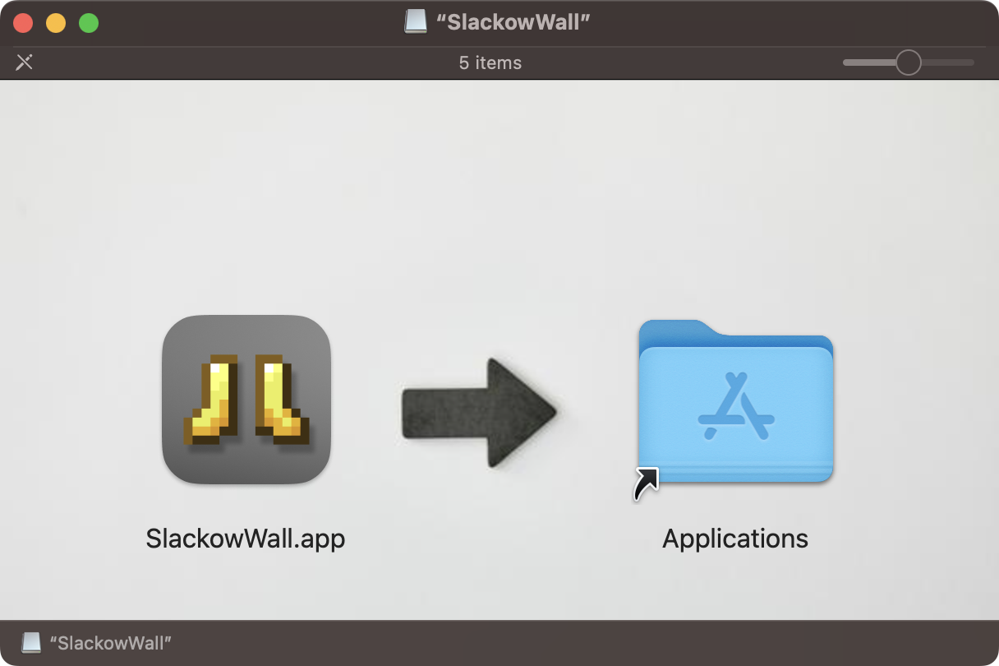
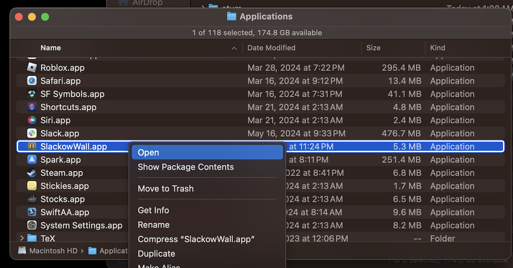

# SlackowWall Setup Guide

## Required Software
- SlackowWall requires you use [PrismLauncher](https://prismlauncher.org) (highly recommended) or [MultiMC](https://multimc.org) for it to detect your instances.
- Also make sure your OBS version is 30.1.2 or higher, and the arm version if you are on an M series mac.

## Setting up Instances
Before getting started with Installing SlackowWall, you should make your instances in Prism.

### Setup Instance 1

The name of your first instance should end with a 1, instance numbers are determined by the name of the instance this way. (Ex: `1.16Inst1`) it's also recommended to put your wall into a new group.

Your first instance can be a clone of an existing one, or one you get from following [this guide](https://www.youtube.com/watch?v=GomIeW5xdBM). but make sure your instance also fulfills the following requirements. (This is also a great time to update your mods by checking [here](https://mods.tildejustin.dev/))

Required Mods:
- StandardSettings version 1.2.3 or higher
- Atum

#### Configurations
For standard settings, ensure that you have `pauseOnLostFocus:false` and `f3PauseOnWorldJoin:true` in your instance. (You may have to start your instance if you just added the latest StandardSettings)

if f3 Pausing doesn't exist in your version (<1.13) then leave `pauseOnLostFocus` on

Also leave your Atum keybind to the default of `F6`.

### Setup Instance 2
Copy your first instance, this time end the instance name with a 2 instead. Also untick the `Copy Saves` option, but leave everything else ticked. (ex: `1.16Inst2`)

Now the only thing you have to change is the `standardoptions.txt` file. Copy the path of the **first** instance's `standardoptions.txt` file by holding option after right clicking it:

Now replace the contents of the **second** instance's `standardoptions.txt` file with this path.

This will make the second instance get it's settings from the first, so you only have to adjust the first instance's settings in the future.

### Setup remaining Instances
Now you can create your remaining instances, (usually a total of 4, 6, or 9 depending on your hardware, but you can add more)

Similarlly to creating the second instance, clone the second instance and change the number at the end to be the next instance number (ex: `1.16Inst3`, `1.16Inst4`, `1.16Inst5`)

Just like before, if you mess up a name when creating an instance, do not rename it, just delete the instance and clone it again, (this is because the folder does not get renamed when you rename instances)

You've now created all your instances!

## Getting SlackowWall
- Download `SlackowWall.dmg` from [here](https://github.com/Slackow/SlackowWall/releases/latest/), SlackowWall auto-updates, so no need to get it again after this.
- Open it and drag the app into your Applications folder. 
- Now you'll have to navigate to your Applications folder, which you can do directly from the dmg, or otherwise.
- Right click the app and press "Open" 
- You should see a menu like this: 
Press "Open". (If you don't have that option, try it a second time)

## Setup SlackowWall

The app should now open and prompt you to give it screen recording permissions, because SlackowWall relays your instances to it's main screen, it requires these, so grant them.

You'll need to restart the app now.

 If you see "No Minecraft Instances Detected" open the first instance and then hit the refresh icon in the top right corner. Now press `E` while hovering over an instance. This should attempt to reset it, but actually request accessibility permissions instead, grant these as well.

Now restart the app once more, and functionally SlackowWall should work for you, you can go into its settings menu with `CMD + ,` and read through some of the options, and adjust them how you like.